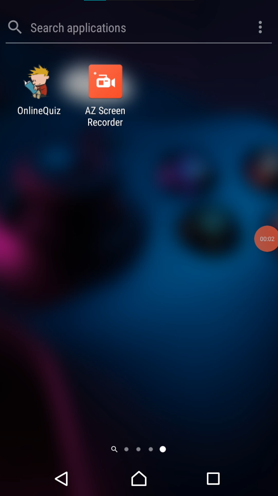
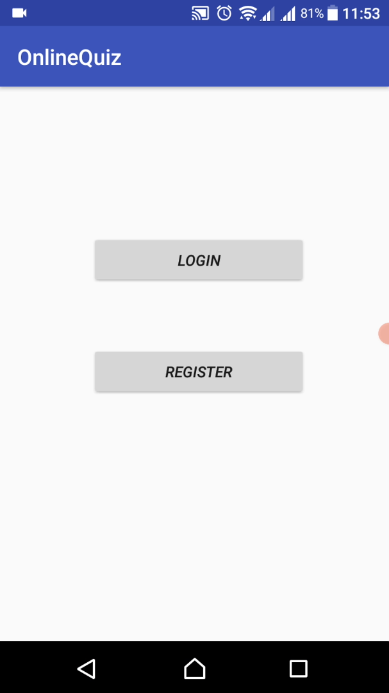
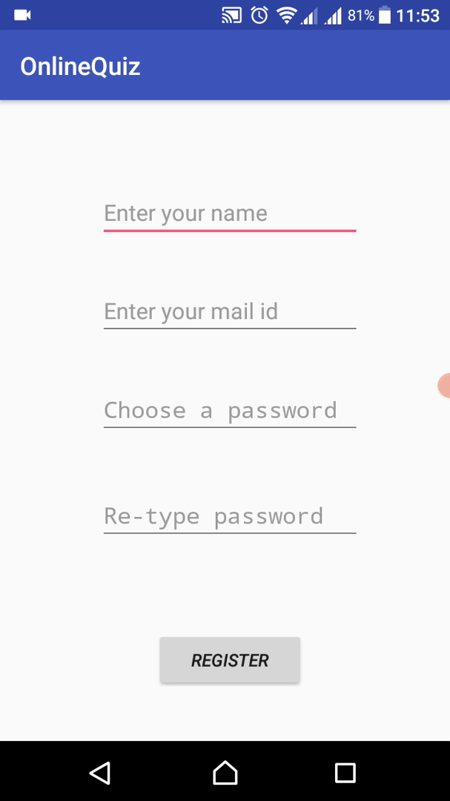
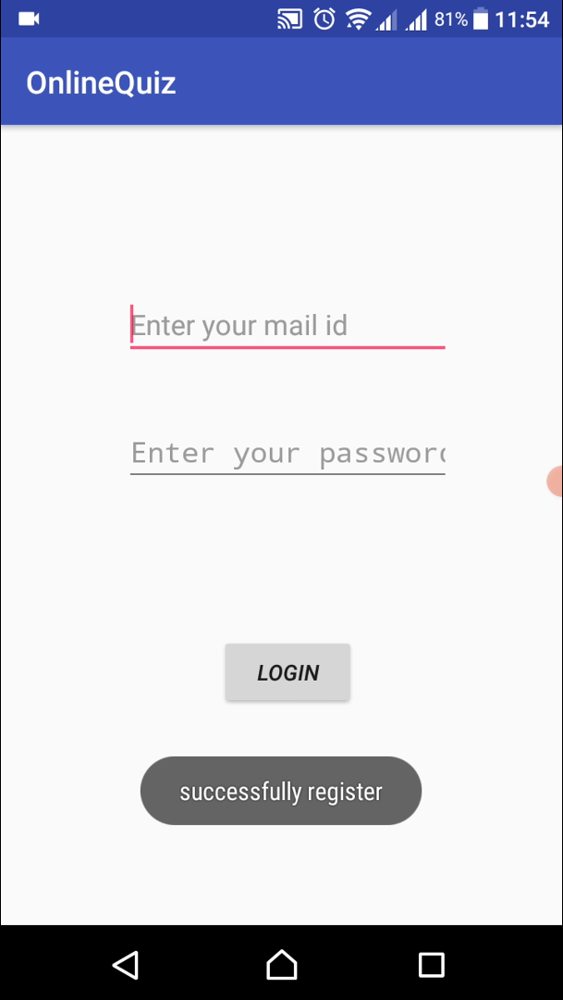
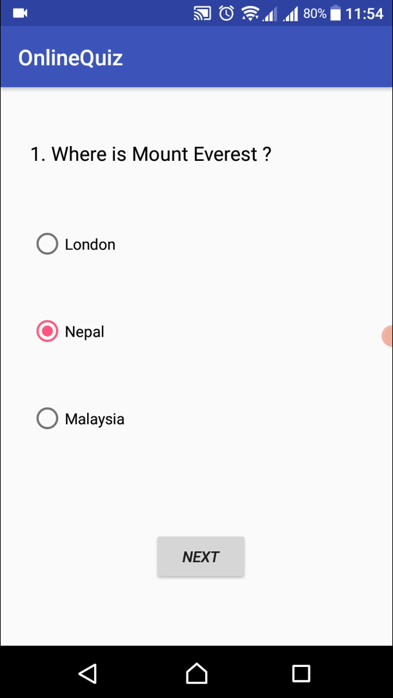
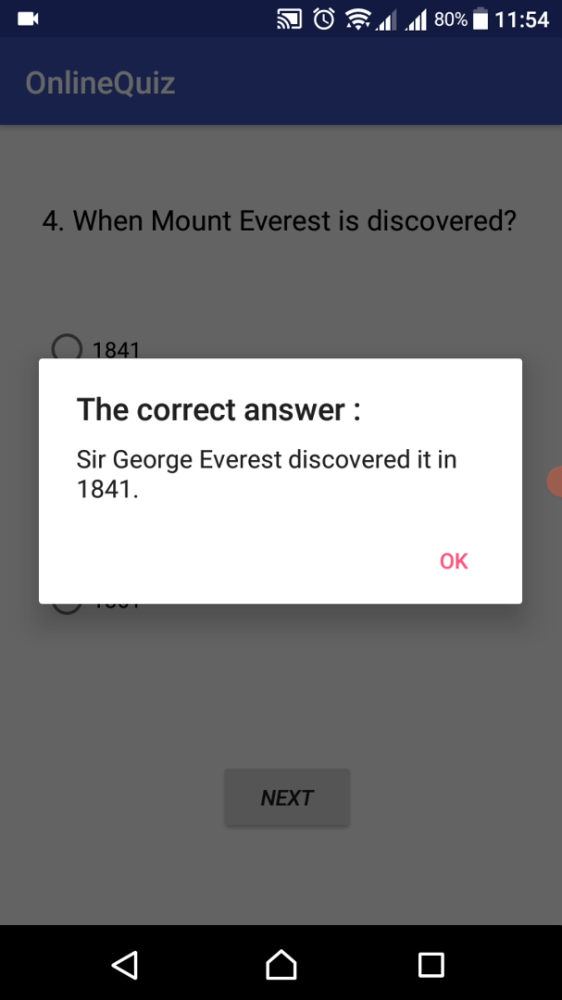
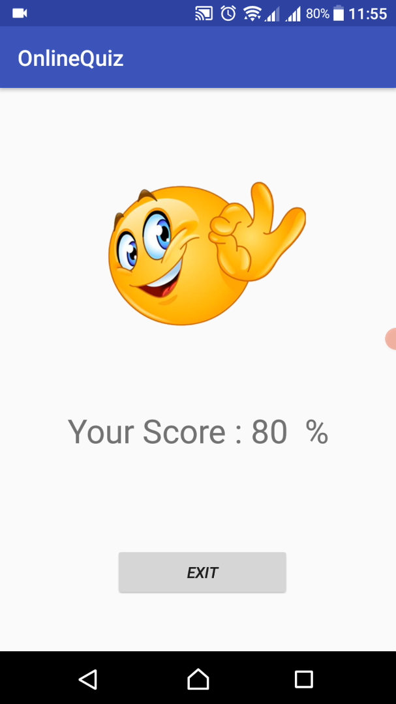

# OnlineQuiz
My first ever android application. (created in 2018) 

This is a simple Quiz app, where users can take part in a quiz and make progress. They also need to register and sign in to take part in Quiz.

## Project description
Name: OnlineQuiz  
Programming Language: Java  
Platfrom: Android application  
Project No: 9  
Year: 2018

## Demo Video

## Screen shot
### Logo
 

### Home Screen
 

### Register Window
 

### Login Window
 

### Quiz Window
 

### Correct user
 

### Results
 

## Authors

* **AbirHasan**

Check out my other works [@XAbirHasan](https://github.com/XAbirHasan)

